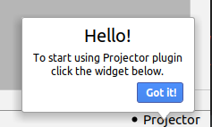

# projector-plugin

This subproject is an IntelliJ plugin for sharing the IDE window using the Projector server.

If you want simultaneous collaborative editing, please try [Code With Me](https://www.jetbrains.com/help/idea/code-with-me.html) solution.
Projector doesn't support that.

## Downloading from Plugins Marketplace

The plugin is published here: <https://plugins.jetbrains.com/plugin/16015-projector>. So you can find it in IDE and install it (manual IDE
restart is needed after installation).

## Usage

New widget `Projector` will appear in the toolbar. 

### Notifications
To attract user's attention to something, the plugin can display a notification. A notification can be easily closed by pressing the "Got It" button.
Message example:



The following notifications are used (please note that we do our best to avoid showing any of them often):
  - **Greeting message** - displayed for each new plugin installation (but no more than once a day) 
  to attract user's attention to the widget. Plugin updates do not trigger the notification. 
  
  - **Mac local connection warning message** - alerts the user about [keyboard input issue](https://youtrack.jetbrains.com/issue/PRJ-321) when connected locally on Mac once per local connection.

## Building from sources

This will give you a zip file with IntelliJ plugin:

```shell script
./gradlew :projector-plugin:buildPlugin  # Java 11 or 17 is required
```

This command creates a zip file in the `projector-plugin/build/distributions` dir.

## Downloading zip file from releases

Alternatively, you can download the zip file from [releases](https://github.com/JetBrains/projector-server/releases/). Please search for the
latest release starting with `agent-...` and find the plugin in Assets there.

## Installing zip file

Install the plugin (the zip file) into IntelliJ-based IDE via `Gear Icon | Install plugin from disk...` menu item in Plugins settings.
