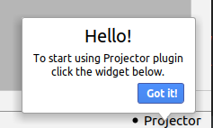

# projector-plugin

This subproject is an IntelliJ plugin for sharing the IDE window using the Projector server.

If you want simultaneous collaborative editing, please try [Code With Me](https://www.jetbrains.com/help/idea/code-with-me.html) solution.
Projector doesn't support that.

## The state of Projector

The development of JetBrains Projector as its own standalone product has been suspended. That said, Projector remains an important part of [JetBrains Gateway](https://www.jetbrains.com/remote-development/gateway/), which is the primary remote development tool for JetBrains IDEs. We will focus our efforts on improving and developing Projector in this limited scenario.

Our goal is to provide a rich, full-featured remote development experience with a look and feel that is equal to or better than what you get when working with IDEs locally. The only way to get everything you’re used to having when working locally (low latency, low network traffic, user-defined and OS-specific shortcuts, themes, settings migrations, ssh-agent/port forwarding, and other things) is by installing a dedicated client-side application. The standalone version of Projector is not capable of meeting these goals.

As a result, we no longer recommend using the standalone version of JetBrains Projector or merely making tweaks to incorporate it into your existing IDE servers. We won’t provide user support or quick-fixes for issues that arise when these setups are used. If you have the option to switch from Projector to Gateway, we strongly recommend you do so.

[Learn more about JetBrains Gateway](https://www.jetbrains.com/remote-development/gateway/)

## Downloading from Plugins Marketplace

The plugin is published here:

<a href="https://plugins.jetbrains.com/plugin/16015-projector">
  
</a>

You can also find it in your IDE (the plugin is named as "Projector") and install it.

## Usage

New widget `Projector` will appear in the toolbar. 

### Notifications
To attract user's attention to something, the plugin can display a notification. A notification can be easily closed by pressing the "Got It" button.
Message example:



The following notifications are used (please note that we do our best to avoid showing any of them often):
  - **Greeting message** - displayed for each new plugin installation (but no more than once a day) 
  to attract user's attention to the widget. Plugin updates do not trigger the notification. 
  
  - **Mac local connection warning message** - alerts the user about [keyboard input issue](https://youtrack.jetbrains.com/issue/PRJ-321) when connected locally on Mac once per local connection.

## Building from sources

This will give you a zip file with IntelliJ plugin:

```shell script
./gradlew :projector-plugin:buildPlugin  # Java 11 or 17 is required
```

This command creates a zip file in the `projector-plugin/build/distributions` dir.

## Downloading zip file from releases

Beside downloading the plugin from the Marketplace as described above, you can download the zip file from [releases](https://github.com/JetBrains/projector-server/releases/). Please search for the latest release starting with `agent-...` and find the plugin in Assets there.

## Installing zip file

Install the plugin (the zip file) into IntelliJ-based IDE via `Gear Icon | Install plugin from disk...` menu item in Plugins settings.
